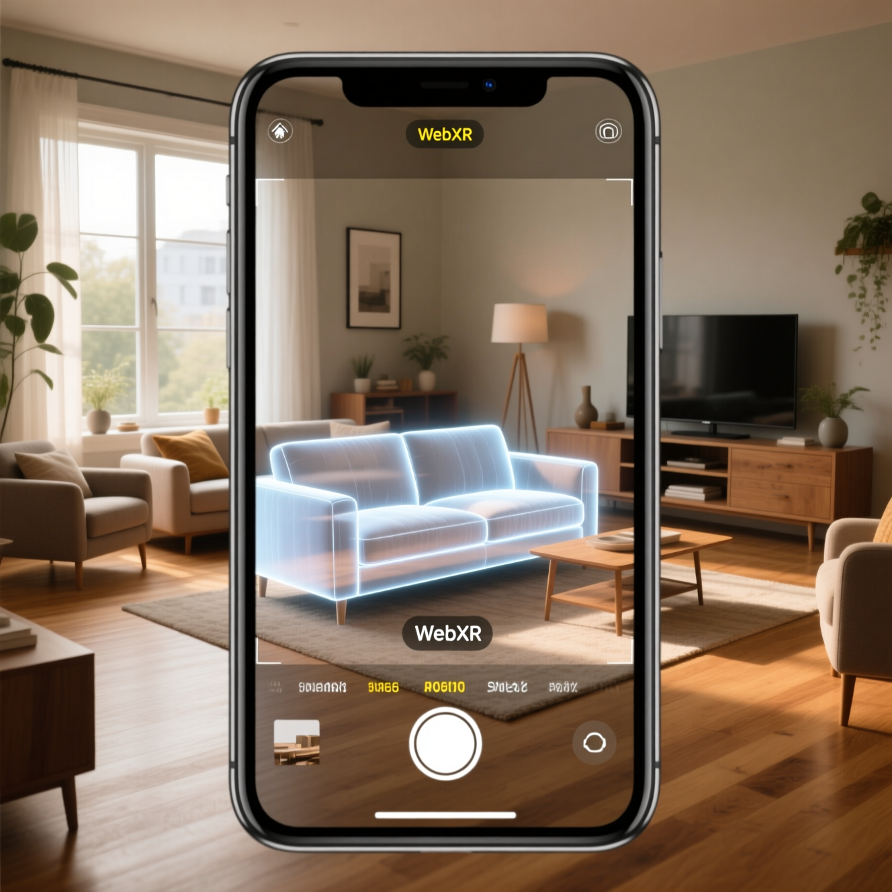
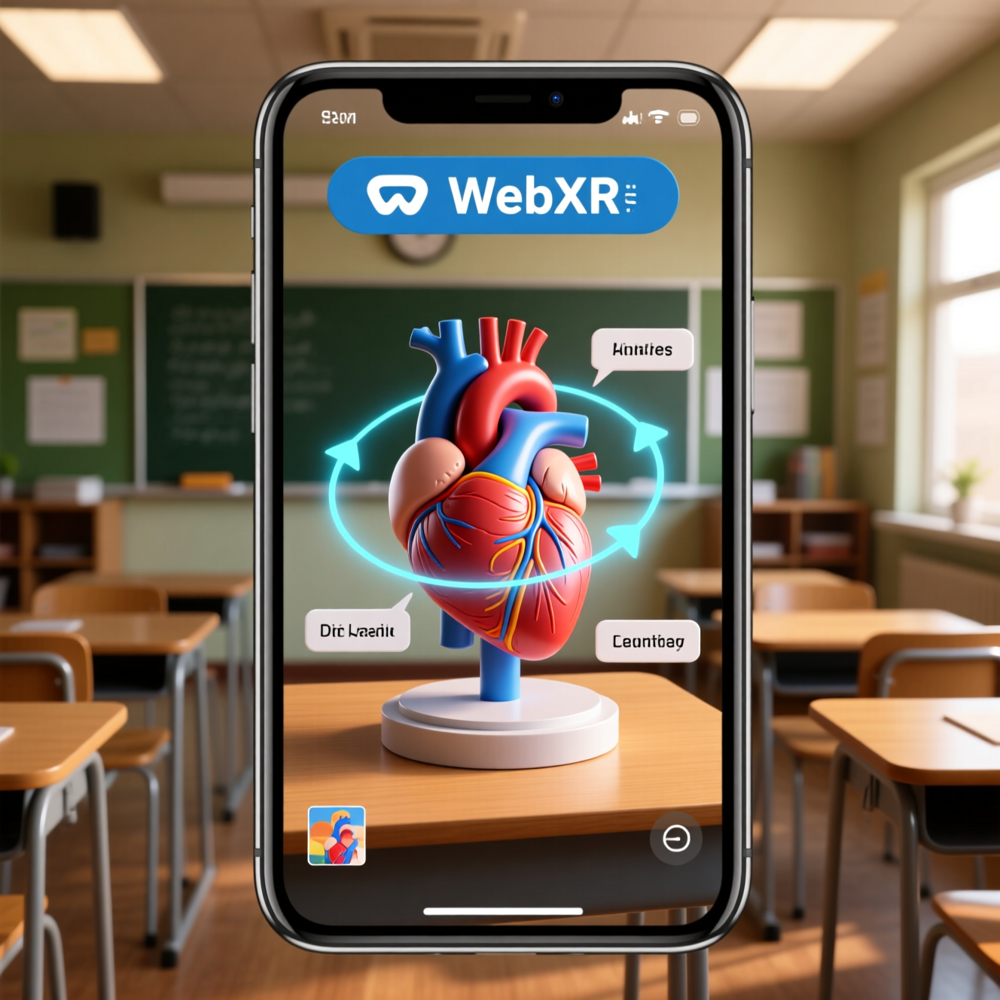

# موضوع تحقیق: استاندارد وب WebXR

# فهرست مطالب

- [موضوع تحقیق: استاندارد وب WebXR](#موضوع-تحقیق-استاندارد-وب-webxr)
  - [استاندارد WebXR چیست؟](#استاندارد-webxr-چیست)
  - [تاریخچه](#تاریخچه)
- [چرا WebXR بهتر است؟](#چرا-webxr-بهتر-است)
  - [مزایای WebXR](#مزایای-webxr)
  - [مقایسه با رقبا](#مقایسه-با-رقبا)
- [ساختار و اجزای اصلی WebXR](#ساختار-و-اجزای-اصلی-webxr)
- [نمای کلی فعالیت با WebXR](#نمای-کلی-فعالیت-با-webxr)
- [نمونه کد ساده](#نمونه-کد-ساده)
- [برخی اجزای پیشرفته فنی](#برخی-اجزای-پیشرفته-فنی)
  - [مهم‌ترین: Hit Testing پیشرفته](#مهمترین-hit-testing-پیشرفته)
  - [ثابت اجزای جدید با Anchors](#ثابت-اجزای-جدید-با-anchors)
  - [جزء Image Tracking](#جزء-image-tracking)
  - [تشخیص سطوح یا Plane Detection](#تشخیص-سطوح-یا-plane-detection)
  - [علائم اشاره Hand Tracking / Gesture Recognition](#علائم-اشاره-hand-tracking--gesture-recognition)
  - [نورپردازی مجازی یا Light Estimation](#نورپردازی-مجازی-یا-light-estimation)
- [Case Study](#case-study)
- [کاربرد در زندگی](#کاربرد-در-زندگی)
- [سخن پایانی](#سخن-پایانی)

## استاندارد WebXR چیست؟

WebXR یک استاندارد وب است که توسط W3C Immersive Web Working Group و با هدف تجربه واقعیت مجازی(VR) و واقعیت افزوده(AR) به صورت مستقیم در مرورگرها، توسعه داده شده است. واژه XR در نام این استاندارد، بیانگر Extended Reality به معنای استفاده از هر دوی VR و AR و یا حتی ترکیبشان، یعنی MR (Mixed Reality) است.



## تاریخچه

پیش‌تر از WebXR، نسخه‌ای ابتدایی تر به نام WebVR API در سال ۲۰۱۶ رونمایی شد که همانطور که از نامش پیداست، صرفا از واقعیت مجازی پشتیبانی می‌کرد و قابلیت AR را نداشت. مشکل اصلی ای که برای افزودن AR به این نسخه وجود داشت، آن بود که به واسطه روش های جداگانه برای افزودن AR، ناسازگاری ای بین دستگاه ها به وجود می‌آورد. به همین جهت، طولی نکشید و صرفا ۲ سال این نسخه قابل استفاده بود، اما با معرفی WebXR در سال ۲۰۱۸، این مشکل مرتفع گردید تا یک API واحد برای همه انواع تجربه‌های واقعیت توسعه‌دهندگان بدهد.

# چرا WebXR بهتر است؟

## مزایای WebXR

برخی از ویژگی هایی که باعث بهبود کیفیت این واسط کاربری در قبال سایر رقبا(که در ادامه بررسی خواهند شد) را بیان می‌کنیم:

- **نیازی به نصب ندارد:** : برای استفاده از WebXR، کافیست از طریق مرورگر، اقدام کنیم و نیازی به نصب از طریق برنامه های گوناگون را ندارد.
- **Cross‑Platform:** هدف کارکرد بر روی هر دستگاهی بدون نیاز به پیش‌نیازی خاصی است.
- **ادغام یکپارچه با وب:** استفاده همزمان از HTML, CSS, JS و کتابخانه‌های وب مثل Three.js یا Babylon.js، یعنی WebXR کاملا قابل ترکیب با وب‌سایت‌ها و اپ‌های تحت وب خواهد بود.
- **به‌روزرسانی و انتشار سریع:** هرگونه آپدیت و ...، بر روی سرور انجام می‌شود و نیازی به عملیاتی از سمت کاربران نیست.
- **امنیت و کنترل دسترسی:** از پروتکل HTTPS استفاده می‌کند و برای دسترسی به دوربین و ...، اجازه دسترسی نیاز است.

## مقایسه با رقبا

رقبای بسیاری تا پیش از ظهور WebXR در دسترس کابران قرار داشت، بخشی شامل اپلیکیشن های بومی AR/VR مانند ARKit، ARCore و بخشی شامل استاندارد های مشابه مانند OpenXR(برای وب نبود) بودند. اما در برابر مزایایی که برای WebXR موارد بیان شده، هیچکدام تحت وب نبودند و در نتیجه، از مزایای WebXR برخوردار نبودند، به همین واسطه، میزان رشد WebXR به مراتب زیاد بود.

- **نیازمند نصب بودند:** تمامی موارد بیان شده، نیازمند نصب و در استفاده از برخی از قابلیت ها، نیازمند پرداخت هزینه بودند.
- **Cross‑Platform نبوند:** به عنوان مثال، ARKit در انحصار اپل بود و صرفا بر روی دستگاه های ios قابل اجرا بود(در مقابل، ARCore برای دستگاه های اندروید و برخی سیستم های دیگر قابل اجرا بودند).
- **عدم ادغام یکپارچه با وب:** معمولاً مجبور بودند رابط کاربر را از صفر بسازند و یا وابسته به SDK خاصی باشند.
- **به‌روزرسانی و انتشار عادی:** با انتشار نسخه جدید برنامه ها، کاربران باید آن‌ها را آپدیت می‌کردند.
- **امنیت و کنترل دسترسی:** امنیت بستگی به سیستم‌عامل دارد، ولی معمولاً دسترسی‌ها پس از نصب و در سطح گسترده داده می‌شود.

# ساختار و اجزای اصلی WebXR

در این بخش، اجزای اصلی WebXR را مطرح خواهیم کرد:

- **XRSession:** اولین نقطه شروع تجربه کاربری از این جزء شروع می‌شود. به عبارتی، XRSession یک session است که تجربه کاربری داخل آن اجرا می‌شود. از انواع آن می‌توان به immersive-vr(تجربه کاربری VR) و immersive-ar(تجربه کاربری AR) اشاره کرد. نمونه کد این بخش را می‌توان در ادامه مشاهده کرد:

```javascript
navigator.xr.requestSession("immersive-vr").then((session) => {
  // آماده اجرای محتوا
});
```

- **XRReferenceSpace:** در این بخش، سیستم مختصات استاندارد تعیین می‌شود، درواقع این بخش، یک چارچوب مختصات (Coordinate system) است که موقعیت‌ها و حرکات را نسبت به آن اندازه می‌گیریم. از انواع آن می‌توان به مواردی همچون viewer، local، local-floor و یا bounded-floor اشاره کرد.

- **XRFrame:** فریم رندر که در هر لحظه از session بروزرسانی می‌شود و تمامی اطلاعات آن فریم را شامل می‌شود. این جزء، با گرفتن Pose کاربر(getViewerPose)، موقعیت و وضعیت ورودی‌ها را آپدیت می‌کند.
- **XRInputSource:** وظیفه کنترل ورودی ها و مدیریت آن‌ها را برعهده دارد، مانند لمس صفحه، حرکات دست و ...، به عبارتی، شناسایی نوع کنترل ها، ردیابی موقعیت و دکمه ها، فعال‌سازی تعامل ها و مواردی از این دست، برعهده XRInputSource خواهد بود.

# نمای کلی فعالیت با WebXR

در گام های پیش‌رو، بالا آوردن یک استاندارد WebXR را به تفصیل، شرح خواهیم داد:

- **بررسی پشتیبانی دستگاه و مرورگر:** در گام اول، باید بررسی کنیم که آیا سیستم مرورگر ما از WebXR پشتیبانی می‌کند یا خیر(که البته در عمده شرایط، مشکلی نخواهد بود، اما برای اطمینان، باید این بخش را جدی در نظر بگیریم).

```javascript
if (navigator.xr) {
  console.log("WebXR Supported");
} else {
  console.log("WebXR Not Supported");
}
```

- **درخواست شروع سشن (XRSession):** این بخش، همان‌طور که پیش‌تر بیان کرده بودیم، با هدف مشخص کردن نوع تجربه کاربری واجب است، به عنوان مثال:

```javascript
navigator.xr.requestSession("immersive-vr").then((session) => {
  // آماده اجرای محتوا...
});
```

توجه داشته باشید که برای درخواست session، می‌توان سه حالت immersive-vr، immersive-ar یا inline را قرار داد.

- **تعریف Reference Space:** این بخش، در واقع همان XRReferenceSpace است که پیش‌تر بیان کرده بودیم و با هدف محاسبات مکان و حرکت نسبت به یک سیستم مختصات، لازم و ضروری است.

```javascript
session.requestReferenceSpace("local-floor").then((refSpace) => {
  // کار کردن با مختصات هم‌سطح زمین
});
```

- **شروع حلقه رندر (Render Loop):** WebXR یک متد خاص به نام session.requestAnimationFrame() دارد و هدف آن، دریافت Pose(دید کاربر) در هر فریم و رندر کردن صحنه با WebGL یا کتابخانه سه‌بعدی (مثل Three.js) است.

```javascript
session.requestAnimationFrame(onXRFrame);

function onXRFrame(time, frame) {
  let pose = frame.getViewerPose(refSpace);
  // رندر صحنه بر اساس pose
}
```

- **مدیریت ورودی‌ها (XRInputSource):** وظیفه این قسمت، دریافت داده از کنترلر ها مانند حرکات دست، لمس صفحه و ... و اختصاص رویداد های مشخص به هر یک از آن‌ها مانند select، squeeze و یا selectstart است.

```javascript
session.addEventListener("select", (event) => {
  console.log("شیء انتخاب شد!");
});
```

- **پایان سشن و آزادسازی منابع:** آزاد سازی منابع در انتهای هر session با session.end();
  به منظور جدوگیری از هدررفتن و اشغال بیهوده CPU و GPU را انجام می‌دهد.

توجه داشته باشید که برای اجرای این استاندارد تحت وب، مهم‌ترین قسمت، امنیت سیستم است. در این استاندارد، از پروتکل HTTPS به منظور تأمین امنیت(مانند امنیت سنسور ها و یا دسترسی به دوربین) استفاده می‌شود و تا زمانی که کاربر، دسترسی مجاز را ندهد، امکان استفاده از آن‌ها مهیا نمی‌شود.

همچنین باید توجه داشت که هنوز، تمامی مرورگر ها، امکان استفاده از این استاندارد را ندارند، مانند safari در سیستم‌عامل ios که هنوز، پیاده‌سازی آن انجام نشده است.

# نمونه کد ساده

```javascript
import * as THREE from "three";

const scene = new THREE.Scene();
const camera = new THREE.PerspectiveCamera();
const renderer = new THREE.WebGLRenderer({ alpha: true });
renderer.xr.enabled = true;
document.body.appendChild(renderer.domElement);

let refSpace, cube;

// بررسی پشتیبانی و شروع
if (navigator.xr) {
  navigator.xr
    .requestSession("immersive-ar", { requiredFeatures: ["local-floor"] })
    .then((session) => {
      renderer.xr.setSession(session);
      session
        .requestReferenceSpace("local-floor")
        .then((rs) => (refSpace = rs));
      session.addEventListener("select", () =>
        cube.material.color.set(Math.random() * 0xffffff)
      );
      initScene();
      renderer.setAnimationLoop((t, frame) => renderLoop(frame));
    });
} else {
  console.error("WebXR not supported");
}

function initScene() {
  const geo = new THREE.BoxGeometry(0.2, 0.2, 0.2);
  const mat = new THREE.MeshBasicMaterial({ color: 0xff0000 });
  cube = new THREE.Mesh(geo, mat);
  scene.add(cube);
}

function renderLoop(frame) {
  if (refSpace && frame) frame.getViewerPose(refSpace); // XRFrame / pose
  cube.rotation.y += 0.01;
  renderer.render(scene, camera);
}
```

در نمونه کد بالا، تمامی قسمت هایی که در بخش قبلی، به صورت مفصل بیان کرده بودیم را می‌توان مشاهده کرد.

# برخی اجزای پیشرفته فنی

تا به اینجا، بیشتر در رابطه با پیاده‌سازی WebXR در سطح پایه و در دسترس عموم صحبت شد، اما در این قسمت، به اجزای فنی و پیچیده‌تر در سطح پیاده‌سازی فنی، مواردی را به ترتیب اهمیت، مطرح خواهیم کرد. در این بخش، به تعدادی از اجزای پیشرفته فنی WebXR خواهیم پرداخت، چالش های آن‌ها را بررسی خواهیم کرد و در نهایت، در صورت امکان، راهکاری برای حل آن‌ها، ارائه می‌کنیم.

# مهم‌ترین: Hit Testing پیشرفته

مهم‌ترین عاملی که در پیاده‌سازی WebXR نیاز است بررسی کنیم، منطق سه‌بعدی ای است که کاربر در حال مشاهده آن است. به عنوان مثال، در تصویری که کاربر روی دستگاه در حال تماشای آن است، در صورتی که اجزای سه‌بعدی مانند میز، تلویزیون و ... وجود داشته باشند، واضح است که WebXR باید وجود این اجسام را تشخیص دهد و آ‌ن‌ها را ۲ بعدی در نظر نگیرد. در WebXR، این اتفاق را با کمک تعریفی تحت عنوان Hit Testing و Hit Testing پیشرفته انجام می‌دهیم. Hit Testing یعنی پیدا کردن نقطه‌هایی روی سطوح واقعی که می‌توانیم اشیای سه‌بعدی را آنجا قرار دهیم. در سطح پیشرفته نیز، Hit Testing به معنای تشخیص سطوح افقی(مثل میز) و سطوح عمودی(مثل دیوار) و درنهایت، انتخاب بهترین نقطه بر اساس زاویه کاربر است. راهکارهای گوناگونی برای پیاده‌سازی این موضوع مطرح شده است که مهم‌ترین آن‌ها به شرح ذیل می‌باشد:

- **استفاده از hit-test API با گزینه requiredFeatures یا optionalFeatures: ['hit-test']**
- **اجرای چندین ray در یک فریم برای بررسی چند سطح.**
- **ترکیب با داده‌های plane detection برای دقت بالاتر.**

# ثابت اجزای جدید با Anchors

مورد دومی که نیاز است به آن توجه داشته باشیم، آن است که با تکان خوردن فرد در محیط، اجزای اضافه شده در صفحه، نباید از جای خود تکان بخورند(فرضا مبلی اگر در تصویر اضافه کرده ایم، با تکان خوردن کاربر، نباید از جای خودش تکان بخورد). Anchor باعث می‌شود اشیای سه‌بعدی، حتی اگر کاربر حرکت کند یا سنسور دوباره محیط را اسکن کند، در جای خود باقی بمانند.

راهکارهای این بخش:

- **وقتی یک نقطه Hit Test شد، با XRFrame.createAnchor() یک anchor ساخته شود.**
- **نگهداری anchor در یک Map یا Array برای آپدیت مکان مدل در هر فریم، می‌تواند خوب باشد.**

# جزء Image Tracking

این قسمت، ساده است. به زبان ساده، Image Tracking را می‌توان تشخیص و دنبال کردن تصویر یا علامت خاص در دنیای واقعی و نمایش سه‌بعدی روی آن، بیان کرد. ساده ترین راهکار برای این قسمت، با توجه به تعریفی که برای session ها ارائه شده بود، استفاده از image-tracking در ویژگی‌های session است.

# تشخیص سطوح یا Plane Detection

تشخیص سطوح صاف بزرگ مثل دیوار، کف یا میز برای پردازش اشیاء را Plane Detection می‌نامند. دو راهکار اصلی برای پیاده‌سازی این بخش وجود دارد:

- **استفاده از plane-detection API (وابسته به سخت‌افزار و مرورگر).**
- **گرفتن داده‌ی نرمال سطح برای درست چرخاندن اشیا.**

# علائم اشاره Hand Tracking / Gesture Recognition

ردیابی دست و تشخیص علائم اشاره‌ای (مانند گرفتن، اشاره، ضربه) برای تعامل بدون کنترلر فیزیکی، می‌تواند یک عامل بسیار مفید در جهت بهبود کیفیت WebXR باشد. برای اجرا، می‌توان از hand-tracking API یا افزونه‌های خاص هدست و یا موارد مشابه، بهره برد.

# نورپردازی مجازی یا Light Estimation

برآورد نور محیط واقعی و هماهنگ کردن نورپردازی و سایه در محیط مجازی تا شیء سه‌بعدی واقعی‌تر دیده شود را Light Estimation می‌نامند که می‌تواند بسیار مفید باشد.

# Case Study

در این قسمت، یک نمونه از استفاده از این استاندارد در دنیای واقعی را بیان خواهیم کرد. فروشگاه آنلاین IKEA. زمینه فروش این فروشگاه، مبلمان منزل است و با استفاده از AR، می‌توان قابلیت قراردادن مبل در خانه را به سادگی انجام داد، به طوری که کاربر، پیش از خرید خود، می‌تواند مبل هارا در هر جهتی که دوست دارد، در رنگ های مختلف و ...، در خانه خود قرار دهد.

# کاربرد در زندگی

به طور کلی، این استاندارد جدید، در تمامی شاخه های تجاری، آموزشی، نظامی و ... می‌تواند کاربرد های فراوان و گسترده ای داشته باشد، به عنوان مثال، از آن می‌توان در شاخه تجاری برای پیش‌نمایش مبلمان و لوازم منزل کمک گرفت، در شاخه آموزشی، می‌توان برای مدل‌سازی های مختلف، کمک گرفت، در زمینه گردشگری می‌توان در بازدید از آثار باستانی از آن کمک گرفت، در صنعت گیم، استفاده از واقعیت مجازی و افزوده، امروزه با استقبال فراوانی روبه‌رو شده است و به همین ترتیب، در آینده نیز، می‌توان در راستای بهبود این استاندارد، فعالیت های گسترده ای انجام داد که پراستقبال ترین آن‌ها، ترکیب WebXR با هوش مصنوعی و بهبود کیفیت بصری و استفاده در زندگی روزمره و اختصاص آن به تمامی مردم(فرضا در گوشی های همراه) خواهد بود.



# سخن پایانی

فناوری WebXR، پلی میان دنیای وب و واقعیت‌های مجازی و افزوده است که با استانداردسازی دسترسی به سخت‌افزارهای AR/VR، مسیر توسعه و تجربه‌های تعاملی را برای عموم کاربران هموار می‌کند. با ترکیب زیرساختی ساده، API‌ قدرتمند و پشتیبانی کتابخانه‌های متن‌باز، WebXR نه‌تنها ابزار توسعه‌دهندگان را غنی‌تر کرده، بلکه گامی مؤثر در آینده‌ی اینترنتِ تجربه‌محور برداشته است. در جهانی که هر روز مرز میان واقعیت و دنیای دیجیتال کمرنگ‌تر می‌شود، WebXR نشان می‌دهد که مرورگر شما می‌تواند پنجره‌ای باشد به بی‌نهایت واقعیت.
